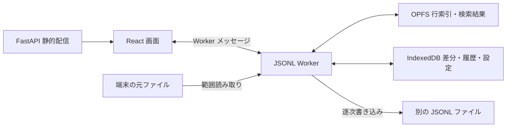

# アーキテクチャ

## 方針とデータの流れ

FastAPI は静的な画面を配信します。JSONL を受信・保存・加工する API はありません。React から専用 Web Worker に処理を依頼し、元の File を小分けに読みます。行索引と検索結果は OPFS、編集差分・作業メタデータ・履歴は IndexedDB に保持します。出力は File System Access API の WritableStream に逐次書き込みます。



元ファイルは FileSystemFileHandle または File として参照するだけで、ブラウザ内に全件コピーしません。1 MiB の読取キャッシュ、最大16 MiBの単一行、8192行分の索引キャッシュを使います。画面の一覧は最大40行を取得し、巨大なスクロール座標を避けるため5000行単位でページを分けます。索引は全件分をディスク上に持ち、メモリには必要なブロックだけを置きます。

## ディレクトリ構造

```text
data_loom/
├── README.md                       起動・使用・保管・検証手順
├── THIRD_PARTY_NOTICES.md          配布する Web フォントの著作権・OFL-1.1
├── pyproject.toml                  Python 依存と data-loom コマンド
├── uv.lock                         Python 依存の固定
├── .python-version                 Python バージョン指定
├── .gitignore                      生成物の除外
├── tokens.css                      Midnight の色・文字・余白トークン
├── .hallmark/
│   ├── preflight.json              新規デザインの前提
│   └── log.json                    デザイン採用記録
├── docs/
│   ├── ARCHITECTURE.md             本書
│   └── VERIFICATION.md             検証結果と制限
├── src/data_loom/
│   ├── __init__.py                 CLI
│   └── web/
│       ├── __init__.py             配信機能パッケージ
│       ├── app.py                  FastAPI の作成と静的配信
│       ├── tests/test_app.py       配信境界の補助テスト
│       └── static/                Vite 生成物（Git 管理外）
├── frontend/
│   ├── package.json               JavaScript 依存とスクリプト
│   ├── package-lock.json          JavaScript 依存の固定
│   ├── tsconfig.json              TypeScript 設定
│   ├── vite.config.ts             React ビルドと配信先設定
│   ├── index.html                 日本語 HTML の入口
│   ├── public/favicon.svg         タブに表示するロゴの SVG
│   ├── node_modules/              ローカル依存（Git 管理外）
│   └── src/
│       ├── main.tsx               React とローカルフォントの読込
│       ├── styles.css             Workbench の画面・レスポンシブ
│       ├── workspace/
│       │   ├── App.tsx            作業画面と操作ダイアログ
│       │   ├── client.ts          Worker RPC クライアント
│       │   ├── worker.ts          作業の処理・排他・入出力
│       │   └── storage.ts         IndexedDB の操作
│       ├── records/
│       │   ├── Editor.tsx         KEY 別の型付き編集欄
│       │   ├── RowList.tsx        行の仮想リスト
│       │   ├── layout.ts          現在値に合わせた自動サイズ
│       │   ├── nested.ts          ネストした値の階層移動と組み立て
│       │   ├── nested.test.ts     経路・精度・表示設定 KEY テスト
│       │   ├── index.ts           行索引・ハッシュ・初期レイアウト
│       │   └── index.test.ts      チャンク境界・診断テスト
│       ├── operations/
│       │   ├── transform.ts       検索条件と KEY 変換
│       │   └── transform.test.ts  精度・衝突・特殊 KEY テスト
│       └── shared/
│           ├── types.ts          共有型
│           ├── browser.d.ts      ブラウザ File System API の型補完
│           ├── json.ts           精度を維持する JSON 処理
│           └── Dialog.tsx        フォーカス・進捗・エラー付き dialog
├── tools/
│   ├── README.md                  実画面検証の手順
│   ├── verify_ui.py               Playwright の headed 検証
│   ├── verify_pins.py             ピン順序・復元・四角い表の実画面検証
│   ├── verify_favicon.py          タブ用 SVG の配信と実画面検証
│   ├── verify_field_layout.py     表・詳細配置と設定パネルの実画面検証
│   ├── verify_nested.py           ネストした値の階層移動と編集の実画面検証
│   ├── verify_edges.py            分割・不正行・保存失敗の実画面検証
│   ├── native_dialog.py           実画面の OS ダイアログ操作
│   ├── browser_metrics.py         ページ・Worker のヒープ測定
│   └── generate_fixtures.py       境界条件・大容量データ生成
└── artifacts/                     データ・画面・trace・プロファイル（Git 管理外）
```

`.venv/`、`__pycache__/`、`.pytest_cache/`、TypeScript のビルド情報も生成物です。

## ファイル・関数・クラスの責務

### Python 配信

- `data_loom.main()`：`--host` と `--port` を読み、Uvicorn を起動します。
- `web.app.create_app()`：FastAPI と `/health`、ビルド済み静的資産の配信を設定します。`health()` は稼働状態、`missing_build()` はビルド不足の案内を返します。`app` が ASGI エントリーポイントです。
- `test_app.py`：`_request()` で ASGI リクエストを補助し、`test_health()` と `test_no_upload_endpoint()` が稼働状態と送信 API を持たない境界を確認します。実画面テストの代用ではありません。

### UI と RPC

全文検索はメイン画面のフォームから実行します。`search(next)` は指定した条件を Worker に渡し、全文検索フォームからは KEY 条件を空にして呼びます。抽出ダイアログでは `datalist` 付きの KEY 入力欄に候補選択と自由入力を統合し、KEY・演算子・値を同じ行に配置します。

- `App()`：ファイル選択、結合順序、作業復元・削除、選択行、操作中のロック、エラー通知を統合します。検索・KEY 操作・出力のダイアログを表示します。検索の KEY 候補は索引作成時に採取した KEY と現在の行の KEY を重複除去して表示し、手入力も受け付けます。内部の `task()` が処理状態、`begin()`／`restore()` が作業開始、`mutate()`／`history()` が行履歴、`changeLayout()` が表示設定、`search()`／`exportNow()` が加工操作を扱います。
- `Editor()`：行を型付き入力へ変換し、入力を検証してから1行の変更を確定します。短い単一行の値（80文字以下）と object / array を左の表、長文を右の詳細に分類し、入力中は位置を固定します。表の object / array は件数付きの「開く」ボタンになり、押すと編集欄をその中身の表へ切り替えます。上部の経路（行 > aaa > bbb）で上の階層へ戻ります。階層を移る際は表示中の入力を検証して行全体の値へ反映し、不正な入力があれば移動を止めます。行を切り替えても、開ける範囲で同じ階層を保ちます。配置を詳細・全幅にした object / array は従来どおり JSON として編集でき、ヘッダーから開けます。内部の `Field()` が KEY ごとの配置・高さ・型変更・ドラッグサイズ保存を担当します。型は6種類のアイコンで表示し、ネイティブ select の選択肢だけに型名を表示します。選択欄のアクセシブル名とキーボード操作を保持します。`Layout.placement` は table / detail / full を保持します。`Layout.pinned` は KEY ごとのピン留め状態です。ピンを安定ソートで先頭へ移し、全幅のピンは左右の列の上に独立したグループとして表示します。解除時は元の KEY 順に戻します。
- `layout.automaticLayout()`：現在の値の長さ・改行・型から幅と高さを算出。手動設定には `Layout.manual` を付け、同じ KEY に維持します。旧設定は自動・手動の区別がないため新方式で再計算します。
- `nested.fieldsOf()`：オブジェクト・配列を1階層分の編集欄へ変換。`containerAt()`／`resolvePath()`：経路の先の値と、開ける最も深い経路。`buildContainer()`：編集欄を検証して値へ戻す。`replaceAt()`：経路上だけを複製して値を置換。`layoutKey()`：入れ子の表示設定 KEY（階層を `LAYOUT_SEPARATOR` で連結、配列の要素は共有）。`summarize()`：件数の要約。`isCompound()`：開ける型の判定。入れ子の表示設定 KEY は抽出条件の KEY 候補から除外します。
- `RowList()`：固定高さの行を必要な範囲だけ表示し、行番号移動と5000行単位のページ送りを提供します。
- `Dialog()`：ネイティブ HTML dialog によるフォーカストラップ、閉じる操作、処理中の進捗・中止・エラーを表示します。
- `client.call()`：連番付きメッセージを Worker に送り Promise を対応付けます。`onUpdate()` は進捗と作業状態の通知を登録します。

### Worker と永続化

- `worker.ts` は1タブにつき1 Worker を持ち、変更処理を排他的に実行します。`navigator.locks` で同じ作業の複数タブ編集を防止します。読取と処理の途中ではメインイベントループへ制御を戻し、中止を受け付けます。
- `create()`：指定順の File を走査し、ソース別索引・ハッシュ・文量の初期設定を作ります。`restore()`：元ファイルのサイズ・更新日時・SHA-256 と索引長を照合して作業を再開します。
- `rawRow()`：索引と確定済み差分から対象行のバイト範囲を取得します。`rowData()` は上限内の行を復号してプレビュー・診断を作り、`listRows()` は必要な一覧だけ返します。
- `search()`：全件を逐次検索し、該当する行 ID を OPFS に追記します。`mutate()`：行の編集・追加・削除を履歴にします。`keyOperation()`：変更プレビューまたは一定量ずつの差分ステージング後、一括変更を確定します。
- `exportData()`：対象行と不正行ポリシーを確認し、元バイト列と差分を1 MiBのバッファで書き出します。行数・ファイル数・容量の分割を行い、元ファイルの上書きと分割出力の同名衝突を防止します。`close()` は OPFS ハンドル・ロックを解放します。
- `storage.listWorkspaces()`／`getWorkspace()`／`saveWorkspace()`：作業一覧・読込・保存。`hasPatches()` は行ブロックに差分があるか確認し、`patchFor()` は現在の履歴以下の最新差分だけを読みます。
- `clearFuture()`：新規編集に先立ち Redo と未確定差分を除去。`stagePatches()`：未確定の差分を小分け保存。`commit()`：作業メタデータと履歴位置を同一トランザクションで確定。`moveHistory()`：Undo／Redo。`deleteWorkspace()`：作業情報・差分・索引を削除します。

IndexedDB `data-loom-v1` は `workspaces`、`patches`、`commits` を持ちます。差分キーは `[workspace, revision, row]`、行検索用索引は `[workspace, row, revision]` です。削除行の本文は `null`。元データの行 ID は作業内で不変、追加行は元行数の後ろに連番で配置します。

OPFS は作業 ID ごとのディレクトリに `source-N.idx` と `results.idx` を持ちます。元索引の各24バイトは64bit浮動小数で正確に表せる整数のバイト位置と長さ、および診断フラグです。検索索引は1行 ID あたり8バイト。索引の最大8192行分だけをキャッシュします。

### JSON と操作

- `index.readEntry()`：固定長の行索引をブロックキャッシュから取得。`scanFile()`：1 MiBずつハッシュを計算し、改行境界を検出・診断・索引化します。各ファイルの最大200有効行から、最大512 KEY の初期表示サイズを決めます。`hashFile()`：再開時の内容照合。
- `transform.matches()`：全文と最上位 KEY の AND 条件を判定。`transformKey()`：追加・削除・改名を適用し、衝突を拒否します。
- `json.parseJson()`：lossless-json で数値字句を保持し重複 KEY を拒否。`parseRecord()`：オブジェクト制約。`jsonText()`：精度を維持した直列化。`valueType()`／`fieldValue()`：型判別と入力変換。`decodeLine()`：厳密な UTF-8 と先頭 BOM。`formatBytes()`：容量表示。
- `types.ts`：`Workspace`、`Source`、`Patch`、`Row`、`Layout` が保存・表示状態、`Filter`／`Condition`、`KeyOperation`、`ExportOptions` が処理設定、`Progress`／`RpcRequest`／`RpcResponse` が通信を表します。

### 検証ツール

- `generate_fixtures.generate()`：境界条件と指定 GiB のデータを逐次生成。`main()` は CLI。
- `verify_ui.verify()`：headed ブラウザを起動して実操作、画像、trace、通信、出力の一致を検証。`main()` は実行設定。
- `verify_pins.verify()`：表・詳細の先頭、全幅の最上段への移動、解除・作業復元、角丸なし、375/768/1255/1600/1920px の表示と KEY の上下中央揃えを実画面で検証します。
- `verify_favicon.verify()`：表示中の Chromium で SVG アイコンの参照と配信応答を確認します。
- `verify_field_layout.verify()`：1255×742 の実画面で null と数値のコンパクト表示、手動サイズ、設定確定・外側クリック・Esc・自動サイズ復帰を確認します。
- `verify_nested.verify()`：表からの2階層の移動、末端の値の編集と精度、不正入力による移動の停止、階層をまたぐ未確定入力の保持、取り消し、行をまたぐ階層の維持、配列の添字表示、JSON の直接編集への切替、375/768/1255px の表示を実画面で検証します。
- `verify_edges.verify()`：実 OPFS ディレクトリへの3方式の分割、行操作、不正編集・KEY 衝突、容量不足の故障注入、複数タブ、不正行・巨大行の保全、変更された元ファイルの拒否を検証します。
- `BrowserMetrics`：CDP セッションを作り、`sample()` でページと Worker のヒープを集計。`_receive()` が Worker の非同期測定結果を受け取ります。
- `NativeDialog`：X11／XTest 接続、`press()`／`type_path()`／`choose()` によるキー入力、`focus_dialog()` による実ダイアログの選択、`click_at()`／`save()` によるボタン操作、`screenshot()` による対象ウィンドウ画像の取得、`close()` による接続解放を提供します。OS 依存の補助であり、Playwright のページ操作を置き換えません。

## 互換性・運用

保存領域はオリジンとプロファイル単位で分離されます。IndexedDB と OPFS は容量制限・削除の対象です。保存失敗でメタデータの履歴位置を進めず、未確定差分は次の変更時に除去します。読み込み未完了の作業は再開不可で、新規読込が必要です。将来のスキーマ変更時は DB バージョンを上げてマイグレーションを追加してください。

静的資産・フォントは同じサーバーから配信します。データ処理中の外部通信や CDN 依存はありません。DuckDB／Polars、共同編集、認証、サーバー保存は含みません。
